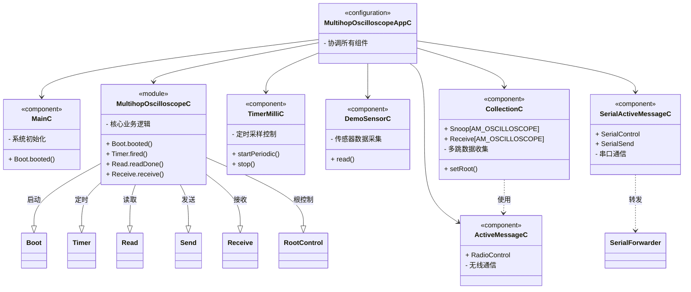

# TinyOS Oscilloscope 程序解释

Multihop Oscilloscope 是一个基于 TinyOS 的多跳传感器网络数据采集和可视化系统，主要功能包括数据采集、无线通讯、GUI可视化和数据转发



示波器（Oscilloscope）掩饰应用程序中，每个节点定期报告一组传感器读数。程序有一个头文件 `Oscilloscope.h` 用于定义其消息和相关常量。

```c
#ifndef MULTIHOP_OSCILLOSCOPE_H
#define MULTIHOP_OSCILLOSCOPE_H

enum {
  /* Number of readings per message. If you increase this, you may have to
     increase the message_t size. */
  NREADINGS = 5,
  /* Default sampling period. */
  DEFAULT_INTERVAL = 1024,
  AM_OSCILLOSCOPE = 0x93
};

typedef nx_struct oscilloscope {
  nx_uint16_t version; /* Version of the interval. */
  nx_uint16_t interval; /* Samping period. */
  nx_uint16_t id; /* Mote id of sending mote. */
  nx_uint16_t count; /* The readings are samples count * NREADINGS onwards */
  nx_uint16_t readings[NREADINGS];
} oscilloscope_t;

#endif
```

<center>示波器程序的常量和数据包布局</center>

示波器的 Java 图形用户界面会显示每个传感器节点的读数曲线图。要确定读数编号（即读数在 X 轴上的位置），需要同时获取计数字段的值和 NREADINGS 常量的值。因此使用机器生成的类解码接收到的 `oscilloscope_t` 消息，并通过 `ncg` 提取 `NREADINGS` 值：

```java
public class Constants {
    public static final byte NREADINGS = 10;
    ...
}
```

<center>由 ncg 生成的类</center>

示波器的消息处理程序可以从接收到的消息中获取读数数组，并将其值存储在偏移量为 `count * NREADINGS` 的 Java 数据数组中：

```java
synchronized public void messageReceived(int dest_addr, Message msg) {
    if (msg instanceof OscilloscopeMsg) {
        OscilloscopeMsg omsg = (OscilloscopeMsg)msg;
    
        /* Update interval and mote data */
        periodUpdate(omsg.get_version(), omsg.get_interval());
        data.update(omsg.get_id(), omsg.get_count(), omsg.get_readings());
    
        /* Inform the GUI that new data showed up */
        window.newData();
    }
}
```

<center>保存接收样本</center>

`ncg` 工具的实现依赖于特殊模式运行 nesC 编译器，因此它不仅能够提取简单常量的值，还能获取由表达式定义的枚举常量值以及 nesC 特有的 unique 和 uniqueCount 函数调用结果。然而这也导致 ncg 存在两个局限性：

无法提取 `#define` 定义的常量值，因为这些常量由 C 预处理器处理，对 ncg 不可见。

若传递给 ncg 的头文件或 nesC 程序存在编译错误，那么 ncg 也不会生成任何输出。


Java mote 接口使用 packet sources 来抽象与 mote 通信的不同方式，包括：

- 直接串口连接（`serial`）
- 远程（通过以太网）串口连接
- 与模拟 mote 的连接（模拟器）
- 通过串口转发器（serial forwarders）的连接，允许多个程序同时与同一 mote 通信

Packet source 的格式为：

```
connection@arguments
```

其中 `connection` 是连接类型（如 `serial`、`sf` 等），`arguments` 是对应的参数，例如串口设备名和波特率：

```
serial@COM1:115200
```

执行以下命令可以打印所有 packet sources 及其参数摘要：

```
java net.tinyos.packet.BuildSource
```

大多数 Java 程序可以通过环境变量（通常是 `MOTECOM`）、命令行参数或 GUI 字段来指定 packet source。

## Serial Forwarder

Serial forwarder 是一个 Java 程序，它连接到 mote，并通过 TCP/IP 将数据包转发给多个客户端。

使用 serial forwarder 的好处包括：

- **远程访问**：例如 GUI 可以在远程位置访问传感器网络。
- **并行调试与运行**：允许常规应用程序和调试工具同时与同一 mote 通信（例如使用 `net.tinyos.tools.Listen` 监听所有数据包）。
- **模块化开发**：可以将应用拆分为独立的接收和发送程序，各自通过 serial forwarder 通信。

例如，`TestSerial.java` 应用可以拆分为独立的收发程序，各自与串口转发器通信。